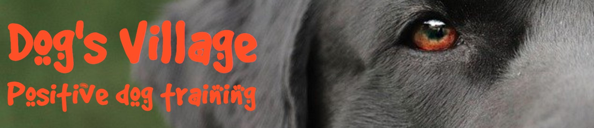

# Dog's Village

For my Milestone Project 1 on Code Institute's Diploma in Software Developement course I have created a dog training website.
This website was develop to people searching for help to train their dogs. On the main page there is a brief explanation about what positive dog training is and the trainers. There is also a page where you can find out more information regarding all types of training offered, a page where you can book your dog's training section and a gallery.

You can check out the website by clicking [HERE](https://rlorimier.github.io/portifolio1_dogsvillage/)

## Who is this for?
Dog's Village is a company that provides especialized cage and force free dog training.
The website was created to conect people with dog trainers and provide some information about the services offered.
The company is based in Finglas, Co. Dublin, where the classes mostly take place. We also offer individual/private classes for those who, for any reason, can not attend insite.

## Features
### Existing features
- Created in HTML5 and CSS using Visual Studio Code.

- Image and Logo:
Featured on all pages, image of the eye and part of the head of a black dog, with the company logo on the left.

- Navigation bar:
Featured on all pages, the navigation bar includes links to the Home page, What We Offer page, Make your booking page and Gallery page.

- The Footer:
Featured on all pages, the footer section includes links to social media sites for the company. The links will open to a new tab to allow easy navigation for the user.

- 4 different pages:
  1. Home page: 
  Contains a brief information about the company and the type of training offered. Also contains information about how to contact us by phone and email and the address including a map.
  2. What We Offer page: 
  Contains information about all types of training offered, allowing the user to choose the best option available in relation to his/her needs.
  3. Make Your Booking page: 
  Contains a booking form, where the user inputs contact information about him/herself and a few details about the dog, selects the suitable training option and writes us a message if needed.
  4. Gallery: 
  Contais photos of our dogs during insite training.
### Features for future implementation
- Add a reviews page.
- Booking form to work properly, store, and forward inputted data.
- Cookie pop-up baner.
- Covid-19 information.
- Another future idea.

## Technologies used
- HTML5 for markup
- CSS3 for style
- [Dafont](https://www.dafont.com/) for fonts
- [Favicon](https://favicon.io/) for favicon
- [Font Awesome](https://fontawesome.com/) for icons
- [ColorSpace](https://mycolor.space/) for color pallet
- [Google DevTools](https://developer.chrome.com/docs/devtools/) for responsiveness
- [Visual Studio Code](https://code.visualstudio.com/) as IDE
- [Git](https://git-scm.com/) for version control
- [GitHub](https://github.com/) to storage files and deployment of the website

## Resources
- [Code Institute](https://codeinstitute.net/) course materials and Slack community
- [W3schools](https://www.w3schools.com/)
- [Curso em Video](https://www.cursoemvideo.com/)

## Credits
### Content
- The Text used on the What We Offer page was written by the website author.
- The Text used on the Home page was taken from Wikipedia and compiled by the author.
### Media
- Photos and images taken from open souces websites: 
    - [Pixabay](https://pixabay.com/)
    - [Freepik](https://www.freepik.com/) 
    - [Pexels](https://www.pexels.com/?locale=en-us)

## Testing
### Browser Testing
The website buttons, links and functionality has been tested.
Tests has been carried out on Google Chrome, Microsoft Edge, Firefox, Internet Explorer and Samsung Internet.
#### Issue
*On Internet Explorer the primary fonts are not supported, however the website is still funcional and works as intended.*
### Validators
- HTML: The website has been through W3C HTML Validator and the results are as follows:
  - [Home](https://validator.w3.org/nu/?doc=https%3A%2F%2Frlorimier.github.io%2Fportifolio1_dogsvillage%2Findex.html) - Warning for lack of heading on the articles
     #### *The heading is inside the child. The html structure consists in article>section>h2>*
  - [Classes](https://validator.w3.org/nu/?doc=https%3A%2F%2Frlorimier.github.io%2Fportifolio1_dogsvillage%2Fclasses.html) - No error
  - [Booking](https://validator.w3.org/nu/?doc=https%3A%2F%2Frlorimier.github.io%2Fportifolio1_dogsvillage%2Fbooking.html) - No error
  - [Gallery](https://validator.w3.org/nu/?doc=https%3A%2F%2Frlorimier.github.io%2Fportifolio1_dogsvillage%2Fgallery.html) - Warning for lack of heading on the section
    #### *Section only contains photos*

- CSS: The website has also been through Jigsaw Validator with [no errors/warnings](https://jigsaw.w3.org/css-validator/validator?uri=https%3A%2F%2Frlorimier.github.io%2Fportifolio1_dogsvillage%2Findex.html&profile=css3svg&usermedium=all&warning=1&vextwarning=&lang=en) shown.

## Deployment
Coming soon

